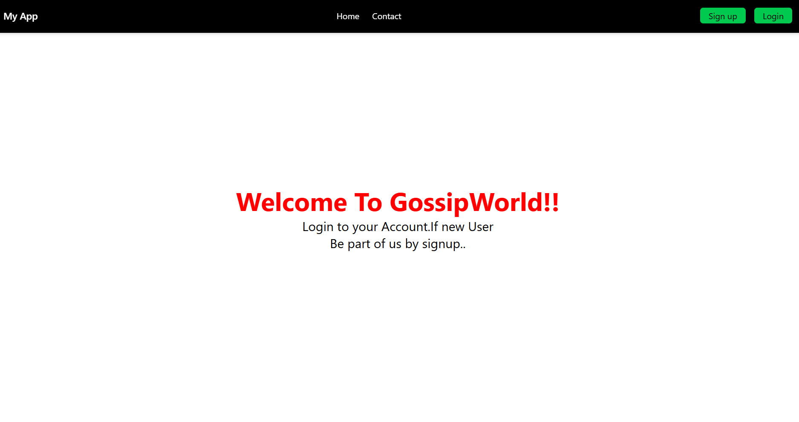
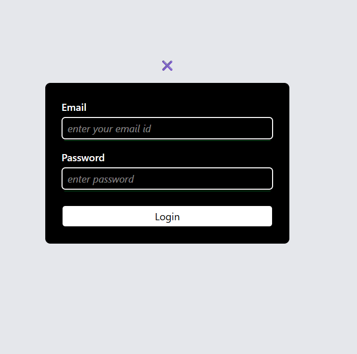
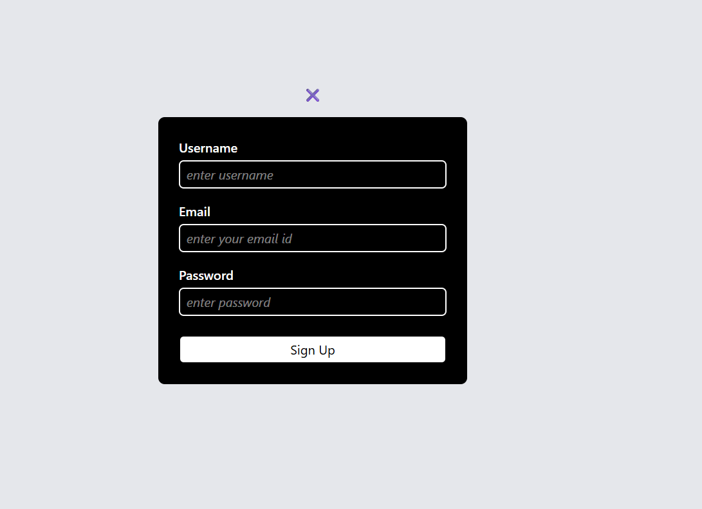
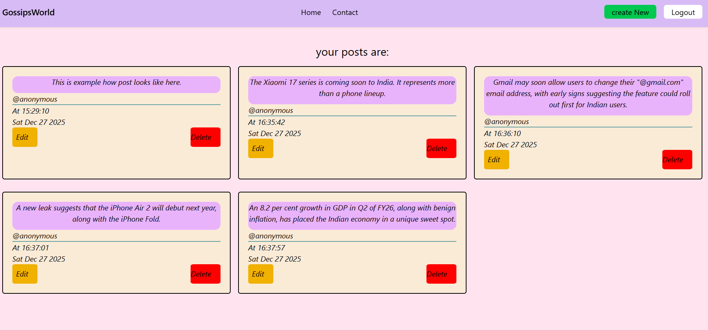

# GossipsWorld 🗣️

GossipsWorld is a **full-stack Node.js web application** that allows users to securely create, view, edit, and delete posts after authentication.  
It demonstrates **real-world authentication**, **authorization**, and **CRUD operations** using modern backend practices.

---
## 📸 Screenshots

### 🔐 Home Page


### 🔐 Login Page


### 📝 Signup Page


### 🏠 Dashboard (After Login)


---

## 🚀 Features

- 🔐 **User Authentication**
  - Signup & Login with hashed passwords (bcrypt)
  - JWT-based authentication
  - Secure HTTP-only cookies

- 🛡️ **Authorization**
  - Only logged-in users can access protected routes
  - Users can edit/delete **only their own posts**

- 📝 **Posts (CRUD)**
  - Create new posts
  - View all your posts after login
  - Edit existing posts
  - Delete posts

- 🔄 **Post-Redirect-Get (PRG) Pattern**
  - Prevents duplicate form submissions
  - Avoids post duplication on page refresh

- 🎨 **UI**
  - Built with EJS templates
  - Styled using Tailwind CSS
  - Basic layout (not optimized for responsiveness)

---

## 🛠️ Tech Stack

### Backend
- Node.js
- Express.js
- MongoDB
- Mongoose
- JSON Web Tokens (JWT)
- bcrypt
- cookie-parser
- method-override

### Frontend
- EJS (Embedded JavaScript Templates)
- Tailwind CSS

---

## 🔐 Environment Variables

This project uses environment variables to keep secrets secure.

Create a `.env` file in the root directory:

```env
JWT_SECRET=your_secret_key_here
MONGO_URI=your_mongodb_connection_string